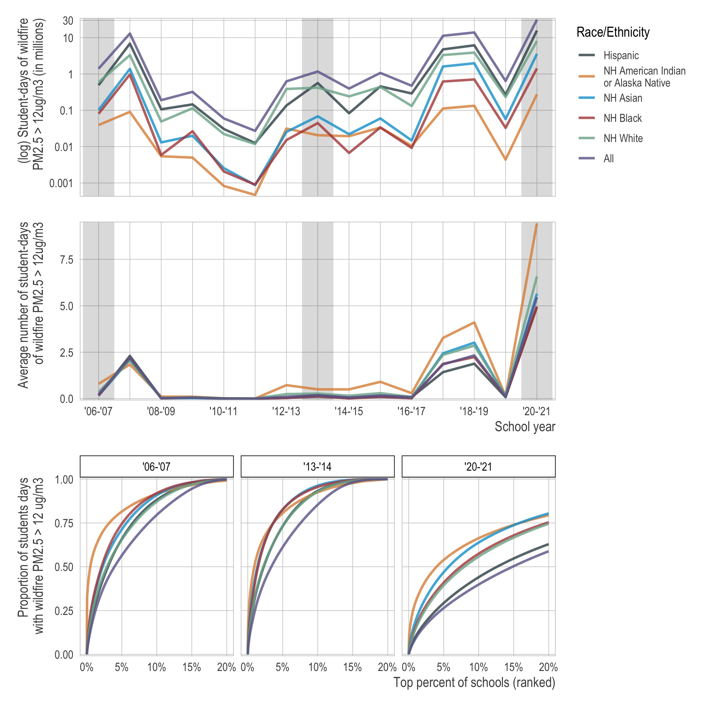

<!-- README.md is generated from README.Rmd. Please edit that file -->

```{r, include = FALSE}
knitr::opts_chunk$set(
  collapse = TRUE,
  comment = "#>"
)
```

## Quantifying exposure to wildfire smoke among school-aged children in California, 2006 – 2021




This repository, [`wildfires_school_exposure`](https://github.com/mkiang/wildfires_school_exposure), contains reproducible code for our open-access *JAMA Network Open* research letter, ["Quantifying exposure to wildfire smoke among school-aged children in California, 2006 – 2021"](https://jamanetwork.com/journals/jamanetworkopen/fullarticle/2803124), which uses publicly-available school enrollment [data from the NCES](https://nces.ed.gov/ccd/elsi/) and [wildfire PM2.5 estimates](https://www.sciencedirect.com/science/article/pii/S0160412022006468) to quantify the number of student-days of wildfire smoke exposure among California kids. The full citation is:

> Velásquez EE, Benmarhnia T, Casey JA, Aguilera R, Kiang MV. Quantifying exposure to wildfire smoke among school-aged children in California, 2006 - 2021. *JAMA Network Open*. 2023;6(4):e235863. doi:  [10.1001/jamanetworkopen.2023.5863](https://jamanetwork.com/journals/jamanetworkopen/fullarticle/2803124)

For interested readers, [an invited commentary](https://jamanetwork.com/journals/jamanetworkopen/fullarticle/2803129) was published along side the letter. 

## About this repository

All code can be found in the `./code` folder and must be run in order. The first few lines of each code file contains a brief description of the tasks related to that file. Numeric representation of our figures can be found in the `./output` folder. Figures are in the `./plots` folder. The table was generated using `rmarkdown` and both source and output are in the `./rmds` folder. 

Due to file size limitations on Github, the files in `./data` and `./data_raw` are *not* in this repository. They must be [downloaded from OSF](https://osf.io/f4aku) and then decompressed into the root directory or can be downloaded by running `./code/00_get_data_files.R`. 

## Authors (alphabetical)
-   [Rosana Aguilera](https://profiles.ucsd.edu/rosanamaria.aguilerabecker)
-   [Tarik Benmarhnia](https://tbenmarhnia.scrippsprofiles.ucsd.edu)
    (:
    [benmarhnia-lab](https://github.com/benmarhnia-lab) \|
    :
    [@tbenmarhnia](https://twitter.com/tbenmarhnia))
-   [Joan A Casey](https://deohs.washington.edu/faculty/joan-casey)
    (:
    [joanacasey](https://github.com/joanacasey) \|
    :
    [@joanacasey](https://twitter.com/joanacasey))
-   [Mathew V Kiang](https://mathewkiang.com)
    (:
    [mkiang](https://github.com/mkiang) \|
    :
    [@mathewkiang](https://twitter.com/mathewkiang))
-   Esther E Velásquez
    (:
    [evelasq](https://github.com/evelasq))

## Notes on Reproducibility

We use [`renv`](https://rstudio.github.io/renv/index.html) for package management but below we also post the relevant session information to ensure full reproducibility. As stated above, data files are publicly available but must be [downloaded from OSF](https://osf.io/f4aku) due to file size constraints on Github. Run `./code/00_get_data_files.R` to download and unzip the relevant data files. 

```{r, eval=FALSE}
> sessioninfo::session_info()
─ Session info ─────────────────────────────────────────────────────────────────
 setting  value
 version  R version 4.1.2 (2021-11-01)
 os       macOS 13.2.1
 system   aarch64, darwin20
 ui       RStudio
 language (EN)
 collate  en_US.UTF-8
 ctype    en_US.UTF-8
 tz       America/Los_Angeles
 date     2023-02-26
 rstudio  2022.07.2+576 Spotted Wakerobin (desktop)
 pandoc   2.19.2 @ /Applications/RStudio.app/Contents/MacOS/quarto/bin/tools/ (via rmarkdown)

─ Packages ─────────────────────────────────────────────────────────────────────
 package      * version    date (UTC) lib source
 assertthat     0.2.1      2019-03-21 [2] CRAN (R 4.1.0)
 backports      1.4.1      2021-12-13 [2] CRAN (R 4.1.1)
 broom          0.7.11     2022-01-03 [2] CRAN (R 4.1.1)
 bslib          0.3.1      2021-10-06 [2] CRAN (R 4.1.1)
 cachem         1.0.6      2021-08-19 [2] CRAN (R 4.1.1)
 cellranger     1.1.0      2016-07-27 [2] CRAN (R 4.1.0)
 cli            3.4.0      2022-09-08 [1] CRAN (R 4.1.1)
 codetools      0.2-18     2020-11-04 [2] CRAN (R 4.1.2)
 colorspace     2.0-2      2021-06-24 [2] CRAN (R 4.1.1)
 config       * 0.3.1      2020-12-17 [2] CRAN (R 4.1.0)
 crayon         1.4.2      2021-10-29 [2] CRAN (R 4.1.1)
 DBI            1.1.2      2021-12-20 [2] CRAN (R 4.1.1)
 dbplyr         2.1.1      2021-04-06 [2] CRAN (R 4.1.0)
 digest         0.6.29     2021-12-01 [2] CRAN (R 4.1.1)
 doParallel   * 1.0.17     2022-02-07 [2] CRAN (R 4.1.1)
 dplyr        * 1.0.10     2022-09-01 [1] CRAN (R 4.1.1)
 ellipsis       0.3.2      2021-04-29 [2] CRAN (R 4.1.0)
 evaluate       0.14       2019-05-28 [2] CRAN (R 4.1.0)
 fansi          1.0.0      2022-01-10 [2] CRAN (R 4.1.1)
 fastmap        1.1.0      2021-01-25 [2] CRAN (R 4.1.0)
 fontawesome    0.2.2      2021-07-02 [2] CRAN (R 4.1.0)
 forcats      * 0.5.1      2021-01-27 [2] CRAN (R 4.1.1)
 foreach      * 1.5.2      2022-02-02 [2] CRAN (R 4.1.1)
 fs           * 1.5.2      2021-12-08 [2] CRAN (R 4.1.1)
 furrr        * 0.2.3      2021-06-25 [2] CRAN (R 4.1.0)
 future       * 1.29.0     2022-11-06 [1] CRAN (R 4.1.2)
 generics       0.1.3      2022-07-05 [1] CRAN (R 4.1.1)
 ggplot2      * 3.3.5      2021-06-25 [2] CRAN (R 4.1.1)
 ggsci        * 2.9        2018-05-14 [2] CRAN (R 4.1.1)
 globals        0.16.1     2022-08-28 [1] CRAN (R 4.1.1)
 glue           1.6.2      2022-02-24 [1] CRAN (R 4.1.1)
 gtable         0.3.0      2019-03-25 [2] CRAN (R 4.1.1)
 haven          2.4.3      2021-08-04 [2] CRAN (R 4.1.1)
 here         * 1.0.1      2020-12-13 [2] CRAN (R 4.1.0)
 hms            1.1.1      2021-09-26 [2] CRAN (R 4.1.1)
 htmltools      0.5.2      2021-08-25 [2] CRAN (R 4.1.1)
 httpuv         1.6.5      2022-01-05 [2] CRAN (R 4.1.1)
 httr           1.4.4      2022-08-17 [1] CRAN (R 4.1.1)
 ineq         * 0.2-13     2014-07-21 [1] CRAN (R 4.1.0)
 iterators    * 1.0.14     2022-02-05 [2] CRAN (R 4.1.1)
 janitor      * 2.1.0      2021-01-05 [2] CRAN (R 4.1.0)
 jquerylib      0.1.4      2021-04-26 [2] CRAN (R 4.1.0)
 jsonlite       1.8.4      2022-12-06 [1] CRAN (R 4.1.1)
 knitr        * 1.37       2021-12-16 [2] CRAN (R 4.1.1)
 later          1.3.0      2021-08-18 [2] CRAN (R 4.1.1)
 lifecycle      1.0.1      2021-09-24 [2] CRAN (R 4.1.1)
 listenv        0.8.0      2019-12-05 [2] CRAN (R 4.1.0)
 lubridate      1.8.0      2021-10-07 [2] CRAN (R 4.1.1)
 magrittr       2.0.3      2022-03-30 [1] CRAN (R 4.1.1)
 mime           0.12       2021-09-28 [2] CRAN (R 4.1.1)
 miniUI         0.1.1.1    2018-05-18 [2] CRAN (R 4.1.0)
 modelr         0.1.8      2020-05-19 [2] CRAN (R 4.1.0)
 munsell        0.5.0      2018-06-12 [2] CRAN (R 4.1.0)
 parallelly     1.32.1     2022-07-21 [1] CRAN (R 4.1.1)
 patchwork    * 1.1.1      2020-12-17 [2] CRAN (R 4.1.1)
 pillar         1.6.4      2021-10-18 [2] CRAN (R 4.1.1)
 pkgconfig      2.0.3      2019-09-22 [2] CRAN (R 4.1.0)
 prefixer       0.1.5.9000 2022-11-04 [1] Github (dreamRs/prefixer@e43f934)
 promises       1.2.0.1    2021-02-11 [2] CRAN (R 4.1.0)
 purrr        * 0.3.4      2020-04-17 [2] CRAN (R 4.1.0)
 R6             2.5.1      2021-08-19 [2] CRAN (R 4.1.1)
 Rcpp           1.0.8.3    2022-03-17 [1] CRAN (R 4.1.1)
 readr        * 2.1.1      2021-11-30 [2] CRAN (R 4.1.1)
 readxl         1.3.1      2019-03-13 [2] CRAN (R 4.1.0)
 renv           0.15.4     2022-03-03 [1] CRAN (R 4.1.1)
 reprex         2.0.1      2021-08-05 [2] CRAN (R 4.1.1)
 rlang          1.0.5      2022-08-31 [1] CRAN (R 4.1.1)
 rmarkdown      2.11       2021-09-14 [2] CRAN (R 4.1.1)
 rprojroot      2.0.2      2020-11-15 [2] CRAN (R 4.1.0)
 rstudioapi     0.13       2020-11-12 [2] CRAN (R 4.1.0)
 rvest          1.0.2      2021-10-16 [2] CRAN (R 4.1.1)
 sass           0.4.2      2022-07-16 [1] CRAN (R 4.1.1)
 scales         1.2.1      2022-08-20 [1] CRAN (R 4.1.1)
 sessioninfo    1.2.2      2021-12-06 [2] CRAN (R 4.1.1)
 shiny        * 1.7.1      2021-10-02 [2] CRAN (R 4.1.1)
 shinyWidgets   0.7.4      2022-10-05 [1] CRAN (R 4.1.1)
 snakecase      0.11.0     2019-05-25 [2] CRAN (R 4.1.0)
 stringi        1.7.6      2021-11-29 [2] CRAN (R 4.1.1)
 stringr      * 1.4.0      2019-02-10 [2] CRAN (R 4.1.1)
 tibble       * 3.1.6      2021-11-07 [2] CRAN (R 4.1.1)
 tidyr        * 1.1.4      2021-09-27 [2] CRAN (R 4.1.1)
 tidyselect     1.1.1      2021-04-30 [2] CRAN (R 4.1.0)
 tidyverse    * 1.3.1      2021-04-15 [2] CRAN (R 4.1.0)
 tzdb           0.2.0      2021-10-27 [2] CRAN (R 4.1.1)
 usmap          0.6.0      2022-02-27 [2] CRAN (R 4.1.1)
 usmapdata      0.1.0      2022-02-09 [2] CRAN (R 4.1.1)
 utf8           1.2.2      2021-07-24 [2] CRAN (R 4.1.0)
 vctrs          0.4.1      2022-04-13 [1] CRAN (R 4.1.1)
 withr          2.5.0      2022-03-03 [1] CRAN (R 4.1.1)
 xfun           0.29       2021-12-14 [2] CRAN (R 4.1.1)
 xml2           1.3.3      2021-11-30 [2] CRAN (R 4.1.1)
 xtable         1.8-4      2019-04-21 [2] CRAN (R 4.1.0)
 yaml           2.3.7      2023-01-23 [1] CRAN (R 4.1.1)
 zipzcta      * 0.0.0.9000 2022-08-08 [1] Github (jjchern/zipzcta@11e241b)

 [1] /Users/mvk/Library/R/arm64/4.1/library
 [2] /Library/Frameworks/R.framework/Versions/4.1-arm64/Resources/library
```

```{r, eval=FALSE}
> sessionInfo()
R version 4.1.2 (2021-11-01)
Platform: aarch64-apple-darwin20 (64-bit)
Running under: macOS 13.2.1

Matrix products: default
LAPACK: /Library/Frameworks/R.framework/Versions/4.1-arm64/Resources/lib/libRlapack.dylib

locale:
[1] en_US.UTF-8/en_US.UTF-8/en_US.UTF-8/C/en_US.UTF-8/en_US.UTF-8

attached base packages:
[1] parallel  stats     graphics  grDevices utils     datasets  methods   base     

other attached packages:
 [1] furrr_0.2.3        future_1.29.0      janitor_2.1.0      fs_1.5.2          
 [5] config_0.3.1       doParallel_1.0.17  iterators_1.0.14   foreach_1.5.2     
 [9] ggsci_2.9          patchwork_1.1.1    knitr_1.37         ineq_0.2-13       
[13] zipzcta_0.0.0.9000 here_1.0.1         forcats_0.5.1      stringr_1.4.0     
[17] dplyr_1.0.10       purrr_0.3.4        readr_2.1.1        tidyr_1.1.4       
[21] tibble_3.1.6       ggplot2_3.3.5      tidyverse_1.3.1    shiny_1.7.1       

loaded via a namespace (and not attached):
 [1] lubridate_1.8.0     fontawesome_0.2.2   httr_1.4.4         
 [4] rprojroot_2.0.2     tools_4.1.2         backports_1.4.1    
 [7] bslib_0.3.1         utf8_1.2.2          R6_2.5.1           
[10] DBI_1.1.2           colorspace_2.0-2    withr_2.5.0        
[13] tidyselect_1.1.1    compiler_4.1.2      cli_3.4.0          
[16] rvest_1.0.2         xml2_1.3.3          sass_0.4.2         
[19] scales_1.2.1        digest_0.6.29       rmarkdown_2.11     
[22] pkgconfig_2.0.3     htmltools_0.5.2     sessioninfo_1.2.2  
[25] parallelly_1.32.1   prefixer_0.1.5.9000 dbplyr_2.1.1       
[28] fastmap_1.1.0       rlang_1.0.5         readxl_1.3.1       
[31] rstudioapi_0.13     jquerylib_0.1.4     generics_0.1.3     
[34] jsonlite_1.8.4      magrittr_2.0.3      usmap_0.6.0        
[37] Rcpp_1.0.8.3        munsell_0.5.0       fansi_1.0.0        
[40] lifecycle_1.0.1     stringi_1.7.6       yaml_2.3.7         
[43] snakecase_0.11.0    grid_4.1.2          listenv_0.8.0      
[46] promises_1.2.0.1    crayon_1.4.2        miniUI_0.1.1.1     
[49] haven_2.4.3         hms_1.1.1           pillar_1.6.4       
[52] codetools_0.2-18    reprex_2.0.1        glue_1.6.2         
[55] evaluate_0.14       usmapdata_0.1.0     renv_0.15.4        
[58] modelr_0.1.8        vctrs_0.4.1         tzdb_0.2.0         
[61] httpuv_1.6.5        cellranger_1.1.0    gtable_0.3.0       
[64] assertthat_0.2.1    cachem_1.0.6        xfun_0.29          
[67] mime_0.12           xtable_1.8-4        broom_0.7.11       
[70] later_1.3.0         globals_0.16.1      shinyWidgets_0.7.4 
[73] ellipsis_0.3.2 
```
